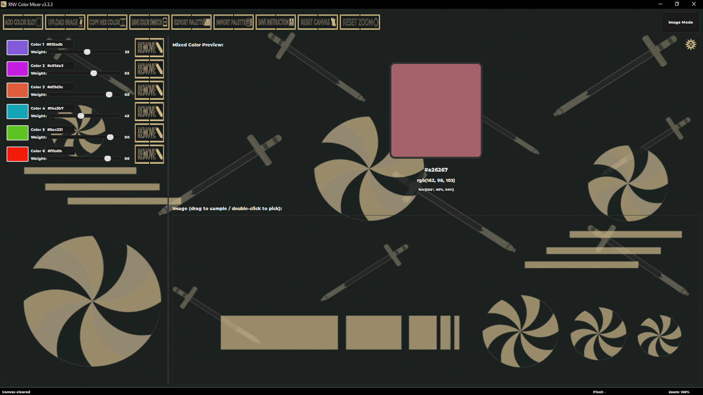
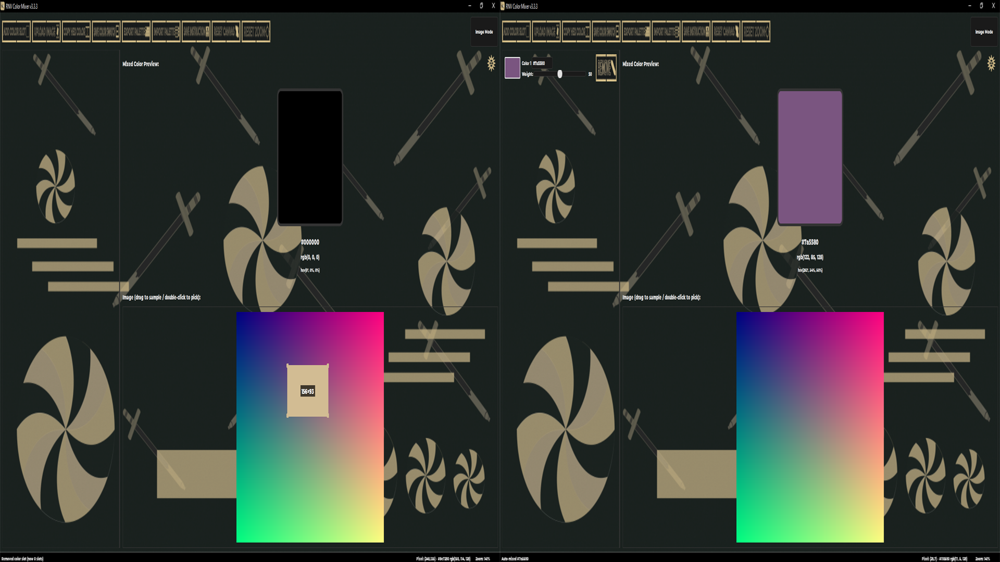
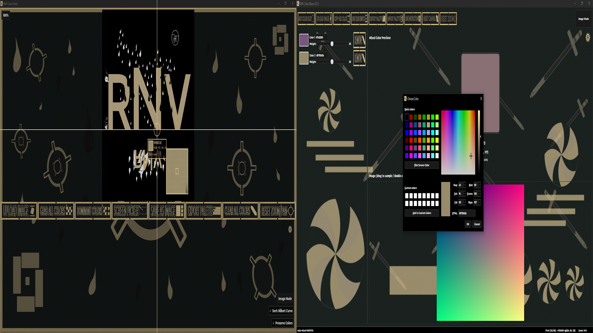
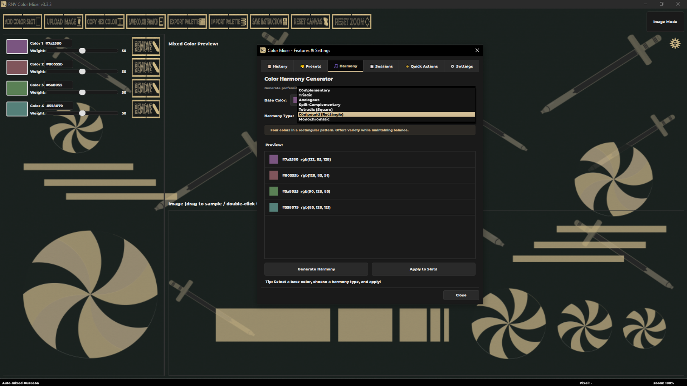
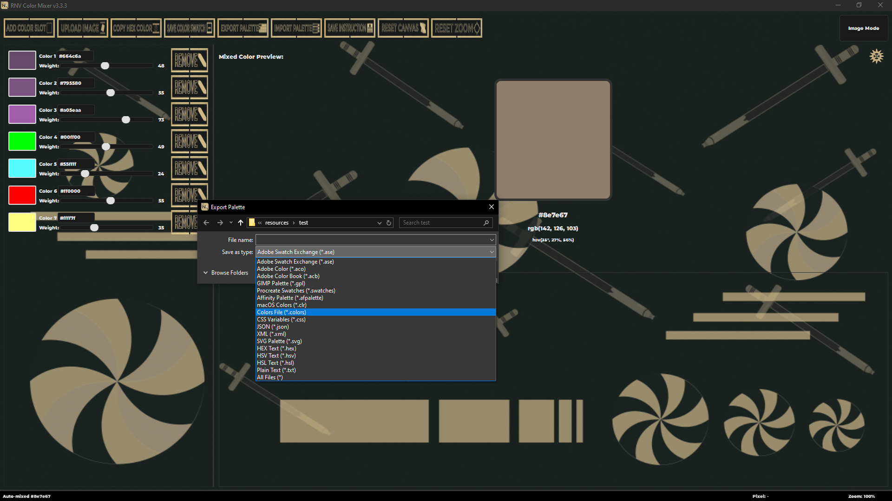
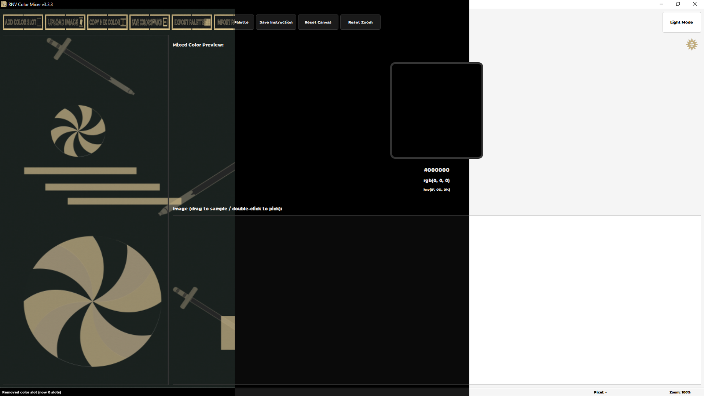

# RNV Color Mixer

> Bringing real-world paint mixing to the digital palette.


[](https://github.com/RNVizion/rnv-color-mixer/actions/workflows/tests-linux.yml)
[](https://github.com/RNVizion/rnv-color-mixer/actions/workflows/tests-windows.yml)

A professional desktop color-mixing application for artists, designers, and
color enthusiasts. Simulates real-world paint mixing behavior using color
science (including Kubelka-Munk theory), and offers a full suite of tools
for sampling, harmonizing, and exporting colors.

Built with Python 3.10+ and PyQt6.

---

## Screenshots

<table>
  <tr>
    <td width="50%" align="center">
      
      <br/><sub><b>Main window</b> — multi-slot color mixing with real-time preview</sub>
    </td>
    <td width="50%" align="center">
      
      <br/><sub><b>Image sampling</b> — click or drag to sample colors from any loaded image</sub>
    </td>
  </tr>
  <tr>
    <td width="50%" align="center">
      
      <br/><sub><b>Screen picker</b> — magnified crosshair sampling across all monitors</sub>
    </td>
    <td width="50%" align="center">
      
      <br/><sub><b>Color harmonies</b> — complementary, triadic, tetradic, and more</sub>
    </td>
  </tr>
  <tr>
    <td width="50%" align="center">
      
      <br/><sub><b>Palette export</b> — 16+ formats including ASE, ACO, GPL, CSS, SCSS</sub>
    </td>
    <td width="50%" align="center">
      
      <br/><sub><b>Theme modes</b> — Dark, Light, and Image mode with custom backgrounds</sub>
    </td>
  </tr>
</table>

---

## Features

**Color mixing**
- Weighted mixing with up to 12 color slots, each with its own slider
- Six algorithms: RGB, HSV, LAB, CMY (subtractive), RYB (weighted), and Kubelka-Munk
- Real-time preview with hex / RGB / HSV readouts
- Right-click fine-tune dialog (lighten, darken, saturate, hue shift, temperature, tint/shade)

**Image sampling**
- Drag-and-drop image loading
- Click to sample individual pixels; drag to average a region
- Scroll-wheel zoom and pan for large images
- Cross-monitor screen color picker with magnified crosshair overlay

**Color harmonies**
- Complementary, analogous, triadic, split-complementary, tetradic, and square schemes
- One-click apply to fill all slots with a generated palette

**Palette I/O (16+ formats)**
- Export: ASE (Adobe), ACO (Photoshop), GPL (GIMP/Inkscape), PAL, ACT, CSS, SCSS, JSON, XML, SVG, and more
- Import: auto-detect format from extension
- Preset palettes: built-in schemes plus user-defined palettes

**Session management**
- Auto-save with crash recovery
- Six persistent session slots plus manual save/load
- Color history (last 20 mixed colors, searchable and reloadable)

**Theming**
- Three visual themes: Dark mode, Light mode, and Image mode (with custom background)
- Custom tooltip system with full CSS control (bypasses native OS tooltip rendering)
- Embedded Montserrat Black font for consistent typography

---

## Tech Stack

| Layer | Technology |
|---|---|
| Language | Python 3.10+ |
| GUI | PyQt6 6.5+ |
| Image processing | Pillow |
| Testing | pytest, pytest-qt, hypothesis, unittest |
| Coverage | coverage.py (with branch coverage) |
| Build | PyInstaller (Windows + Linux) |

---

## Installation

Requirements: **Python 3.10 or newer**.

```bash
# Clone or download the project, then from the project root:
pip install -r requirements.txt
python RNV_Color_Mixer.py
```

If you want an isolated environment (recommended):

```bash
python -m venv venv
# Windows:  venv\Scripts\activate
# macOS/Linux:  source venv/bin/activate
pip install -r requirements.txt
python RNV_Color_Mixer.py
```

### Alternative: install as a package

The project ships with a `pyproject.toml`, so you can install it like any
other Python package. After installation, the app is available as a
`rnv-color-mixer` command on your PATH:

```bash
pip install .
rnv-color-mixer
```

Use `pip install -e .` instead for an editable install that picks up
code changes without reinstalling.

### Building a standalone executable

The project ships with a PyInstaller spec file and convenience wrapper
scripts for both Windows and Linux:

```bash
pip install pyinstaller

# Windows:
build_windows.bat

# Linux (first run: chmod +x build_linux.sh):
./build_linux.sh

# Or invoke PyInstaller directly (any platform):
pyinstaller RNV_Color_Mixer.spec
```

The build output lands in `dist/RNV_Color_Mixer/`. On Windows, zip the
folder and share it — end users can run `RNV_Color_Mixer.exe` without
installing Python or any dependencies. On Linux, tar the folder
(`tar -czf RNV_Color_Mixer-linux.tar.gz -C dist RNV_Color_Mixer`) and
distribute that.

The build uses **one-folder mode** rather than one-file mode. One-file
builds unpack to a temp directory on every launch, adding ~3 seconds
to startup; one-folder is larger on disk but launches instantly.

Note: Linux binaries built with PyInstaller are tied to the glibc
version of the build host. For maximum compatibility, build on the
oldest distro you want to support (e.g. Ubuntu 22.04 LTS).

---

## Keyboard shortcuts

| Shortcut | Action |
|---|---|
| `Ctrl+N` | Add color slot |
| `Ctrl+O` | Upload image |
| `Ctrl+C` | Copy mixed color as hex |
| `Ctrl+S` | Save mixed color as image swatch |
| `Ctrl+Shift+C` | Launch screen color picker |
| `Ctrl+,` or `Ctrl+P` | Open settings & features panel |
| `Ctrl+/` | About dialog |
| `F11` | Toggle tooltips |
| `F12` | Toggle debug overlays |

---

## Project structure

```
rnv-color-mixer/
├── RNV_Color_Mixer.py       Main application entry point
├── test_rnv_color_mixer.py  Comprehensive test suite (Suite 1, locked)
├── verify_files.py          Project integrity checker
├── run_tests.py             Unified test runner (both suites + coverage)
├── pytest.ini               Pytest configuration
├── .coveragerc              Coverage.py configuration
├── pyproject.toml           Project metadata & packaging config
├── requirements.txt         Runtime dependencies
├── requirements-test.txt    Test dependencies
├── py.typed                 PEP 561 type-hint marker
├── RNV_Color_Mixer.spec     PyInstaller build specification
├── build_windows.bat        Windows build convenience script
├── build_linux.sh           Linux build convenience script
├── clean_python_cache.bat   Cache cleaner (Windows)
├── clean_python_cache.sh    Cache cleaner (macOS / Linux)
├── KNOWN_ISSUES.md          Documented platform-specific test skips
├── .github/workflows/       GitHub Actions CI (Linux + Windows)
├── tests/                   Suite 2 — pytest test files
├── snapshots/               Reference data for byte-locked tests
├── core/                    Color science, palettes, data models
├── ui/                      Visual layer
├── utils/                   Cross-cutting services
├── resources/               Fonts, icons, button images, backgrounds
└── docs/                    Developer documentation
```

For a deeper module-by-module breakdown, see [`docs/INTERNALS.md`](docs/INTERNALS.md).

---

## Testing

The project carries 886 tests across two harnesses:

| Harness | Tests | Notes |
|---|---|---|
| `unittest` | 356 | Locked byte-integrity suite (`test_rnv_color_mixer.py`) |
| `pytest` | 530 | Modern suite — pytest-qt for Qt threading, hypothesis property tests |
| **Total** | **886** | **~72% TOTAL coverage** with branch coverage enabled |

**Run the full suite:**

```bash
# One-time setup
pip install -r requirements-test.txt

# Run all tests with coverage
python run_tests.py

# Other modes
python run_tests.py --report     # regenerate report from existing data
python run_tests.py --summary    # gaps view (skip 100%-covered files)
```

This runs both harnesses sequentially and produces a combined coverage report.

**Coverage highlights** — modules above 85%:

| Module | Coverage |
|---|---|
| `utils/dialog_helper.py` | 95% |
| `core/color_math.py` | 92% |
| `core/color_harmony.py` | 92% |
| `ui/about_dialog.py` | 89% |
| `core/color_fine_tune.py` | 88% |

CI gates on a 70% TOTAL coverage threshold. The locked test file
(`test_rnv_color_mixer.py`) has its SHA-256 verified on every CI run,
preventing accidental modification — see [`KNOWN_ISSUES.md`](KNOWN_ISSUES.md)
for documented platform-specific test skips.

---

## Architecture Highlights

**Centralized config (`utils/config.py`)** — every color in the app comes
from one file. Theme dicts (`DARK_THEME_COLORS`, `LIGHT_THEME_COLORS`,
`IMAGE_MODE_COLORS`) are referenced by key throughout the codebase. Any
hardcoded color elsewhere is a bug.

**Signal lifecycle management (`utils/signal_manager.py`)** — every Qt
signal connection is tracked via `SignalConnectionManager` and disconnected
on widget close, eliminating the leak-then-crash class of PyQt bugs common
in long-running applications.

**Multi-tier caching (`utils/pixmap_cache.py`)** — LRU cache for zoomed
pixmaps keeps the canvas responsive when zooming into large images
repeatedly. Hit-rate metrics exposed via `get_stats()`.

**Async file I/O (`utils/async_file_ops.py`)** — palette exports, JSON
saves, and crash-recovery autosaves run on `QThread` workers with progress
signals. UI never blocks, even on large palette exports.

**Custom tooltip system** — implemented as a `_ThemedToolTip` widget with
`WA_TranslucentBackground`, because native Qt tooltips on Windows ignore
CSS border-radius. Restored via stable widget-name keys (not `id(widget)`
memory addresses, which change between storage and retrieval).

**Type-annotated codebase** — PEP 604 modern syntax (`X | None` over
legacy `Optional[X]`). Ships with a `py.typed` marker (PEP 561) and a
`[tool.mypy]` config block for static type checking.

For deeper implementation details, see [`docs/INTERNALS.md`](docs/INTERNALS.md).

---

## Related Projects

Part of the RNVizion suite of color tools:

- **[RNV Color Picker](https://github.com/RNVizion/rnv-color-picker)** — Professional color extraction and palette management for designers and developers
- **[RNV Color Palette Manager](https://github.com/RNVizion/rnv-color-palette-manager)** — A professional desktop application for creating, managing, and exporting color palettes

---

## Development notes

**Clean Python cache files:**

```bash
# Windows
clean_python_cache.bat

# macOS / Linux (first run: chmod +x clean_python_cache.sh)
./clean_python_cache.sh
```

Stale `__pycache__` directories can cause confusing import errors after
updating files — run the appropriate script for your OS if you see
unexpected behavior.

**Verify project integrity:**

```bash
python verify_files.py
```

This script confirms every expected file is present, that version constants
are defined, and that no stale Python cache files would cause import issues.

---

## License

[MIT](LICENSE) — free to use, modify, and distribute.

---

## Author

Built by [RNVizion](https://github.com/RNVizion)

---

<p align="center">
  Built with PyQt6 · 886 tests · 72% coverage · Cross-platform CI
</p>
